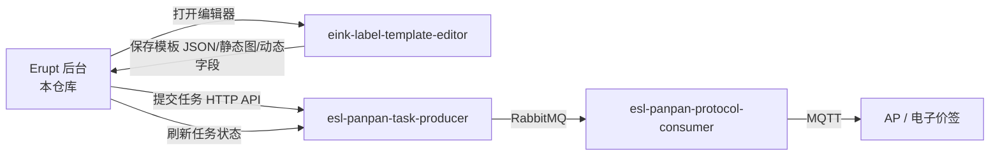

# E-Ink Label Template Admin

`eink-label-template-admin` 是电子价签产品线的后台管理系统。它基于 Spring Boot + Erupt，负责门店、商品、AP、电子价签、模板等业务数据管理，并把真实下发动作提交给 `esl-panpan-task-producer`。

本仓库同时承担模板编辑器的后端保存/读取接口，是 `eink-label-template-editor` 的宿主后台。

## 职责边界

本服务负责：

- 提供 Erupt 后台页面和权限菜单。
- 管理门店、商品、AP、电子价签、模板。
- 从模板管理表打开前端模板编辑器。
- 提供模板读取、编辑器 URL 生成、模板保存 API。
- 提供 MQTT payload 预览接口，便于协议调试。
- 提供真实任务下发入口，调用 `esl-panpan-task-producer`。
- 刷新 producer 任务状态并回写后台业务记录。
- 提供本地演示数据，方便第一次启动后直接测试。

本服务不负责：

- RabbitMQ 命令队列。
- 攀攀 MQTT topic/payload 的最终协议执行。
- AP/ESL ACK 和 report 解析。
- 前端模板画布编辑能力。

## 系统位置



## 技术栈

| 分类 | 技术 |
| --- | --- |
| Runtime | Java 21 |
| Framework | Spring Boot 3.5.x |
| Admin UI | Erupt 1.14.2 |
| Database | H2 file database |
| ORM | Spring Data JPA / Hibernate |
| HTTP Client | Spring `RestClient` |
| Tests | JUnit 5, Spring Boot Test, Mockito |
| Build | Maven Wrapper |

## 快速启动

```bash
cd /path/to/eink-label-template-admin
./mvnw spring-boot:run
```

默认访问地址：

```plain
http://127.0.0.1:8080/
```

如果与 producer 或其他本地服务冲突，四仓联调推荐使用 `10880`：

```bash
SERVER_PORT=10880 \
TASK_PRODUCER_BASE_URL=http://127.0.0.1:18080 \
TEMPLATE_EDITOR_BASE_URL=http://127.0.0.1:5173/ \
./mvnw spring-boot:run
```

默认登录账号：

```plain
账号：erupt
密码：erupt
```

## 本地数据

后台使用本地 H2 文件数据库：

```plain
./data/eink-label-admin.mv.db
```

H2 Console：

```plain
http://127.0.0.1:8080/h2-console
```

连接信息：

| 字段 | 值 |
| --- | --- |
| JDBC URL | `jdbc:h2:file:./data/eink-label-admin;MODE=MySQL;DATABASE_TO_LOWER=TRUE;CASE_INSENSITIVE_IDENTIFIERS=TRUE;NON_KEYWORDS=VALUE` |
| User | `sa` |
| Password | 空 |

`NON_KEYWORDS=VALUE` 是必要配置，用于避免 H2 把 `VALUE` 当关键字导致 Erupt 表结构创建失败。

## 配置项

| 配置 | 默认值 | 说明 |
| --- | --- | --- |
| `SERVER_PORT` | `8080` | 后台 HTTP 端口，四仓联调推荐 `10880` |
| `TEMPLATE_EDITOR_BASE_URL` | `http://127.0.0.1:5173/` | 前端编辑器地址 |
| `TEMPLATE_EDITOR_API_BASE_URL` | `http://127.0.0.1:8080/api` | 传给编辑器的后端 API 根地址 |
| `TEMPLATE_EDITOR_SAVE_API_URL` | `http://127.0.0.1:8080/api/template/save` | 编辑器保存模板的 API |
| `TEMPLATE_EDITOR_LOCALE` | `zh-CN` | 编辑器默认语言 |
| `TEMPLATE_EDITOR_MARKET` | `CN` | 编辑器默认市场 |
| `TASK_PRODUCER_BASE_URL` | `http://127.0.0.1:18080` | 任务生产者 API 地址 |
| `ADMIN_DEMO_DATA_ENABLED` | `true` | 是否自动补充演示门店/AP/商品/价签/模板 |

如果后台端口改成 `10880`，建议同步覆盖传给 editor 的 API 地址：

```bash
SERVER_PORT=10880 \
TEMPLATE_EDITOR_API_BASE_URL=http://127.0.0.1:10880/api \
TEMPLATE_EDITOR_SAVE_API_URL=http://127.0.0.1:10880/api/template/save \
./mvnw spring-boot:run
```

## 后台菜单

启动并登录后，主要菜单在 `价签运营` 下：

| 菜单 | 说明 |
| --- | --- |
| `店铺管理` | 维护门店代码、门店 ID、门店名称、组织。门店代码对应协议中的 `shop/shopcode` |
| `商品管理` | 维护商品编码、名称、价格、促销价、规格、二维码，并绑定模板 |
| `AP管理` | 维护 AP 编码、店内 AP 编号、状态、IP、运行信息，并绑定门店 |
| `电子价签管理` | 维护价签 ID、型号、电量、信号、协议状态，并绑定 AP、商品、店铺 |
| `模板管理` | 维护模板尺寸、色彩模式、设备模板编码、编辑器 JSON、静态图和动态字段 |

## 行操作说明

AP 管理和电子价签管理的自定义行操作分为三类，避免用户把预览和真实下发混淆：

| 操作 | 说明 |
| --- | --- |
| `预览数据` | 只生成协议预览数据，不会真实下发 |
| `提交任务` | 调用 `task-producer` API，进入 producer -> RabbitMQ -> consumer -> MQTT 链路 |
| `刷新状态` | 从 producer 查询最近一次任务状态并回写后台记录 |

模板管理的 `编辑模板` 行操作会打开 `eink-label-template-editor`，并带上模板参数。

## 模板编辑器联动

后台通过 `TemplateEditorLinkService` 生成编辑器 URL。URL 会包含：

- `templateId`
- `templateName`
- `width`
- `height`
- `colorMode`
- `locale`
- `market`
- `apiBase`
- `saveApi`

编辑器保存时会调用：

```plain
POST /api/template/save
```

模板读取和编辑器链接接口：

```plain
GET /api/templates/{id}
GET /api/templates/{id}/editor-url
POST /api/template/save
```

## MQTT 预览接口

这些接口需要 Erupt 登录态，主要用于协议调试和数据检查，不代表真实下发：

```plain
GET  /api/access-points/{id}/shop-binding-command
GET  /api/esl-labels/{id}/update-command
POST /api/esl-labels/{labelId}/bind-product/{productId}
```

## 真实任务下发接口

这些接口需要 Erupt 登录态，会调用 producer：

```plain
POST /api/access-points/{id}/dispatch-shop-binding-task
POST /api/esl-labels/{id}/dispatch-update-task
```

默认 producer 地址：

```plain
http://127.0.0.1:18080
```

价签真实下发前必须满足：

- 价签已绑定店铺。
- 价签已绑定 AP。
- 价签已绑定商品。
- 商品已绑定模板。
- 门店代码、AP 编码、商品编码、价格等 producer 必填字段完整。

## 演示数据

默认启用 `ADMIN_DEMO_DATA_ENABLED=true`。第一次启动后会自动补充一套可联调数据：

| 类型 | 示例 |
| --- | --- |
| 门店 | `ZH01` / 演示门店 |
| AP | `ESLAP00000008` |
| 商品 | `6902538004045` / 脉动维生素饮料 |
| 模板 | `PRICEPROMO` |
| 价签 | `6597069770841` |

关闭演示数据：

```bash
ADMIN_DEMO_DATA_ENABLED=false ./mvnw spring-boot:run
```

## 测试

```bash
./mvnw clean test
```

测试覆盖：

- 模板编辑器链接生成。
- 模板保存 payload。
- MQTT preview payload。
- producer 任务派发请求映射。
- Erupt 菜单/按钮权限回填。
- Erupt 前端 token 缺失补丁。

## 常见问题

### 价签运营菜单能看到，但打开页面是 403

菜单显示和路由权限不是同一件事。请重新启动服务，让 `EruptMenuBackfill` 补齐表级权限和自定义行按钮权限；然后重新登录 `erupt/erupt`。

### 提交任务失败

检查 producer 是否运行：

```bash
curl http://127.0.0.1:18080/api/tasks
```

再确认：

- `TASK_PRODUCER_BASE_URL` 指向正确。
- 价签已绑定 AP、商品、模板。
- producer 与 consumer 使用同一套 RabbitMQ。

### 编辑模板打不开

检查 editor 是否运行：

```bash
curl http://127.0.0.1:5173/
```

如果 editor 端口不是 `5173`，覆盖：

```bash
TEMPLATE_EDITOR_BASE_URL=http://127.0.0.1:4173/ ./mvnw spring-boot:run
```

### 登录页 console 出现 token split 错误

本仓库已通过 `EruptTenantTokenPatchController` 对 Erupt 前端 chunk 做运行时补丁。如果升级 Erupt 后 chunk 名称变化，需要重新检查该补丁是否仍匹配。

## 开发约定

- `预览数据` 只用于本地协议数据检查，不应替代真实任务下发。
- 真实下发必须走 producer API，不要在 admin 内直接投递 RabbitMQ 或 MQTT。
- 新增 Erupt 表或行操作后，必须同步更新 `EruptMenuBackfill` 和权限测试。
- 修改 editor URL 参数时，需要同步 editor 的 boot 参数解析逻辑和本文档。
